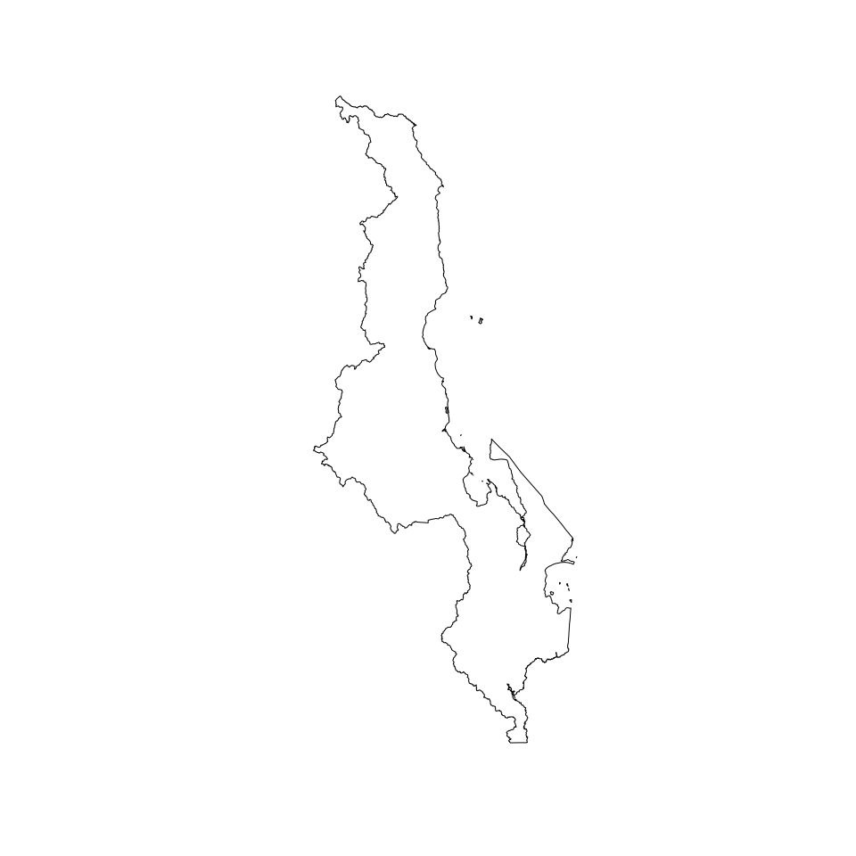
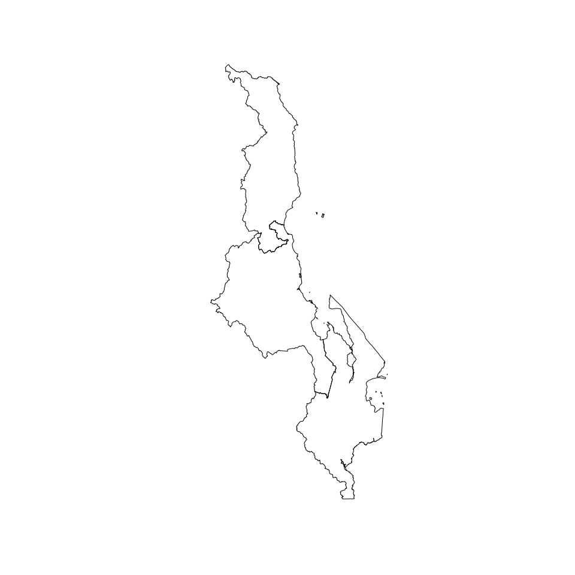
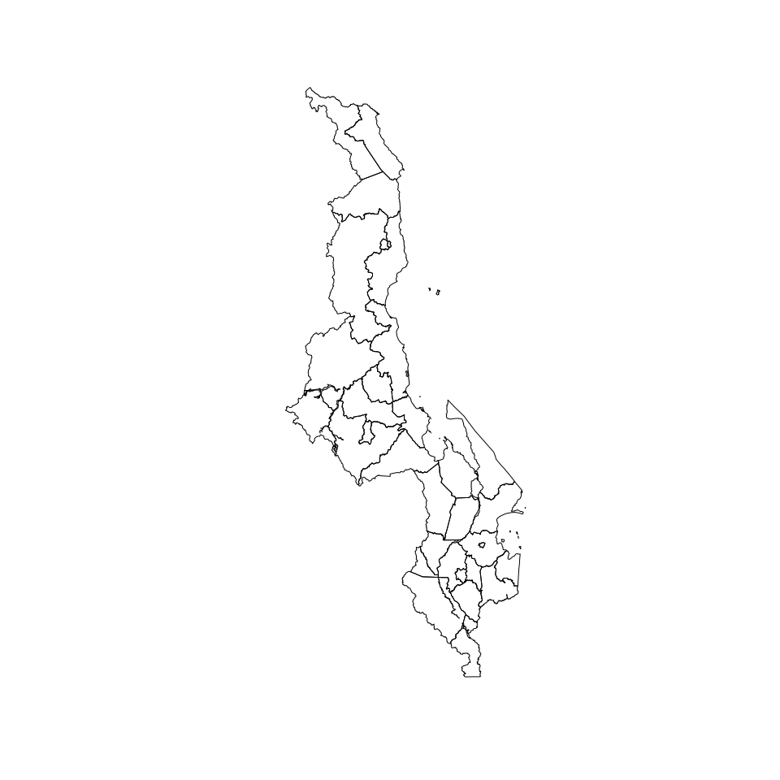
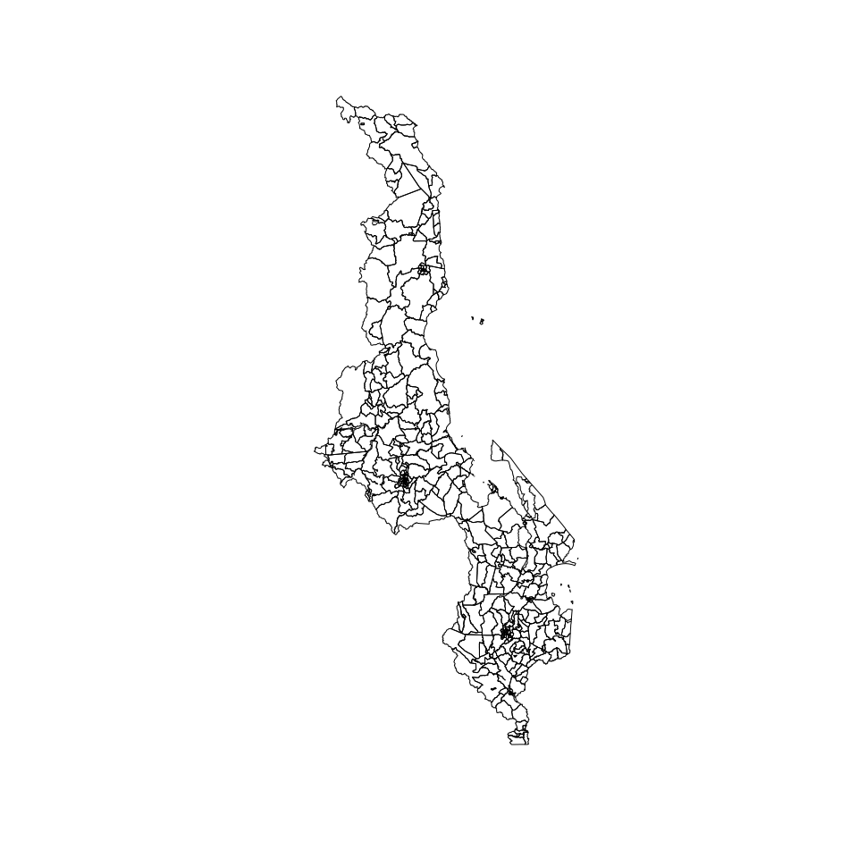

<!-- README.md is generated from README.Rmd. Please edit that file -->

# malawi: Datasets for Designing Surveys in Malawi 

<!-- badges: start -->

[](https://www.repostatus.org/#wip)
[](https://lifecycle.r-lib.org/articles/stages.html#experimental)
[](https://github.com/spatialworks/malawi/actions/workflows/R-CMD-check.yaml)
[](https://github.com/spatialworks/malawi/actions/workflows/test-coverage.yaml)
[](https://www.codefactor.io/repository/github/spatialworks/malawi)
[](https://zenodo.org/badge/latestdoi/445699345)
<!-- badges: end -->

Designing surveys require relevant datasets to be used as basis for
sample size calculations, sampling design, survey planning/logistics and
survey implementation. These include datasets on population, lists of
sampling clusters, map datasets for spatial sampling, and previous
survey datasets that can be used for estimating indicator variance and
design effects. This package contains relevant datasets for use in
designing surveys in Malawi.

## Installation

You can install the development version from
[GitHub](https://github.com/spatialworks/malawi) with:

``` r
if (!require("remotes")) install.packages("remotes")
remotes::install_github("spatialworks/malawi")
```

## Usage

### Retrieve and plot Malawi country borders

    #> Reading layer `mwi_admbnda_adm0_nso_hotosm_20230405' from data source 
    #>   `/tmp/RtmpdHLjP6' using driver `ESRI Shapefile'
    #> Simple feature collection with 1 feature and 7 fields
    #> Geometry type: MULTIPOLYGON
    #> Dimension:     XY
    #> Bounding box:  xmin: 32.67164 ymin: -17.12975 xmax: 35.91848 ymax: -9.367346
    #> Geodetic CRS:  WGS 84



### Retrieve and plot Malawi regions borders

    #> Reading layer `mwi_admbnda_adm1_nso_hotosm_20230405' from data source 
    #>   `/tmp/RtmpdHLjP6' using driver `ESRI Shapefile'
    #> Simple feature collection with 3 features and 9 fields
    #> Geometry type: MULTIPOLYGON
    #> Dimension:     XY
    #> Bounding box:  xmin: 32.67164 ymin: -17.12975 xmax: 35.91848 ymax: -9.367346
    #> Geodetic CRS:  WGS 84



### Retrieve and plot Malawi districts borders

    #> Reading layer `mwi_admbnda_adm2_nso_hotosm_20230405' from data source 
    #>   `/tmp/RtmpdHLjP6' using driver `ESRI Shapefile'
    #> Simple feature collection with 32 features and 11 fields
    #> Geometry type: MULTIPOLYGON
    #> Dimension:     XY
    #> Bounding box:  xmin: 32.67164 ymin: -17.12975 xmax: 35.91848 ymax: -9.367346
    #> Geodetic CRS:  WGS 84



### Retrieve and plot Malawi traditional authority areas borders

    #> Reading layer `mwi_admbnda_adm3_nso_hotosm_20230405' from data source 
    #>   `/tmp/RtmpdHLjP6' using driver `ESRI Shapefile'
    #> Simple feature collection with 433 features and 14 fields
    #> Geometry type: MULTIPOLYGON
    #> Dimension:     XY
    #> Bounding box:  xmin: 32.67164 ymin: -17.12975 xmax: 35.91848 ymax: -9.367346
    #> Geodetic CRS:  WGS 84



### Retrieve and plot Malawi livelihood zones
